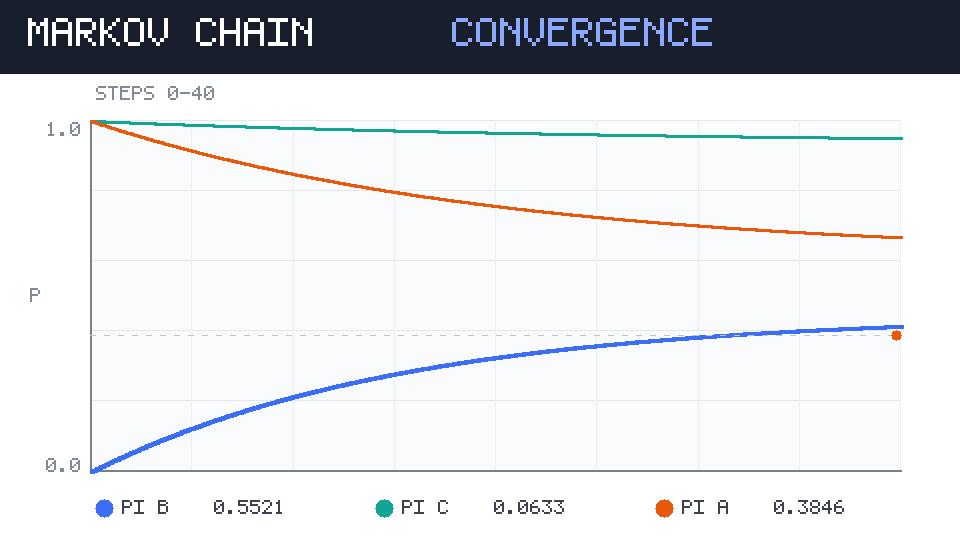

# 开始使用 · 这套笔记怎么用

这是你的笔记站首页推荐入口。整套系统只有一件事需要记住：**内容永远是 Markdown 文件，网页由构建脚本自动生成**。你不需要写一行 HTML。

## 三条命令搞定一切

```bash
# 1. 内容放进来
#    把写好的 .md 丢进 content/ 目录（图片放 content/assets/）

# 2. 生成网页数据
node tools/build.mjs

# 3. 发布上线
git add -A && git commit -m "update notes" && git push
```

推上去大约一分钟后，GitHub Pages 就会自动更新，手机刷新即见。

> [!TIP] 最省事的用法
> 你甚至不用碰这些命令：直接把整理好的文章发给我，我来写 `.md`、跑构建、推送 GitHub。你要的就是一个网址。

## 目录结构

```text
notes-site/
├── content/                  ← 你只需要动这里
│   ├── home.md               首页/置顶说明
│   ├── 01-markdown-语法速查.md
│   ├── 02-随机过程-马尔可夫链建模.md
│   ├── 03-数模方法速查卡.md
│   ├── assets/               图片、PDF、附件
│   └── _extracted.json       附件文字提取结果（图片 OCR / PDF 文本）
├── tools/build.mjs           构建脚本（零依赖，Node 18+）
├── docs/                     构建产物（GitHub Pages 直接托管）
│   ├── index.html
│   ├── css/  js/  data/  assets/
└── README.md
```

## 每一篇笔记的头部（frontmatter）

```yaml
---
title: 标题，会显示在卡片和侧边栏
category: 分类，用于侧边栏分组和图谱配色
tags: [标签一, 标签二]
date: 2026-02-18
pinned: true          # 可选：置顶到首页
summary: 一句话摘要，显示在卡片上（不写则自动截取正文开头）
related: [home]       # 可选：关联笔记
---
```

## 这篇笔记能干什么

- **搜索**：左上角搜索框支持标题、正文、标签、分类，**连图片里的文字和 PDF 正文也能搜到**（见下面那张演示图）
- **目录**：右侧「本页目录」跟着滚动高亮；手机上是顶栏 ☰ 抽屉
- **知识图谱**：顶栏 🕸 看笔记之间的互链关系，节点可拖动整理
- **时间线**：顶栏 🕒 按时间倒序翻
- **排版切换**：顶栏 🎨 在「极简 / 技术 / 杂志」三套版式间切换，选择会记住
- **深浅色**：顶栏 🌗 在「浅 / 深 / 跟随系统」间循环，选择会记住
- **双链**：正文里写 `[[数模方法速查卡]]` 就能互链，反向链接自动出现在文末

## 演示：图片文字也能进检索

下面这张图是示意用的「模型收敛示意图」，它的文字已经预提取进索引。你在搜索框里输入 **马尔可夫链演示图** 或 **收敛曲线**，这篇笔记会被搜出来。



## 把外部内容也变成可搜索的笔记

| 你手上的东西 | 怎么处理 | 搜索效果 |
| --- | --- | --- |
| Word / Markdown 笔记 | 复制进 `content/xxx.md` | 标题、正文、标签全可搜 |
| 论文 PDF | 放 `content/assets/`，正文里 `[附件](assets/xx.pdf)` | 提取的正文文字进检索 |
| 截图 / 拍照笔记 | 放 `content/assets/`，正文里 `` | OCR 出的文字进检索 |
| 微信/网页剪藏 | 贴给我，我整理成结构化 Markdown | 同第一行 |

> [!IMPORTANT] 关于图片 OCR 的现状
> 构建脚本本身零依赖、离线可跑；附件文字提取走 `tools/extract-attachments.mjs`（按需执行一次，结果写入 `content/_extracted.json` 并被构建脚本读取）。
> 执行过提取的附件，其文字会出现在笔记正文末尾的「附件文字」区块，并进入搜索索引——这就是为什么你能搜到图片里的字。

## 下一步

1. 把这篇的 frontmatter 当作模板，开始写你的第一篇
2. 想换配色/版式，改 `docs/css/style.css` 顶部的变量即可（一处改，全站变）
3. 想加功能（标签云、代码高亮主题、批注…）随时说
